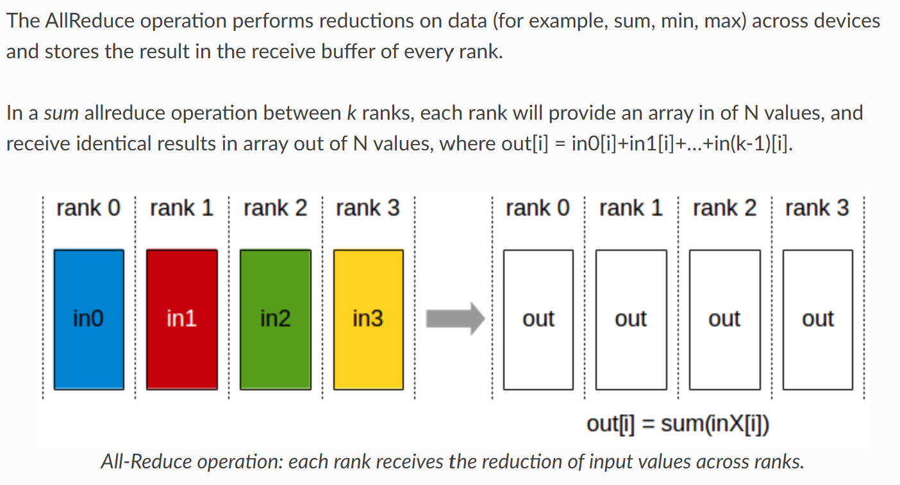
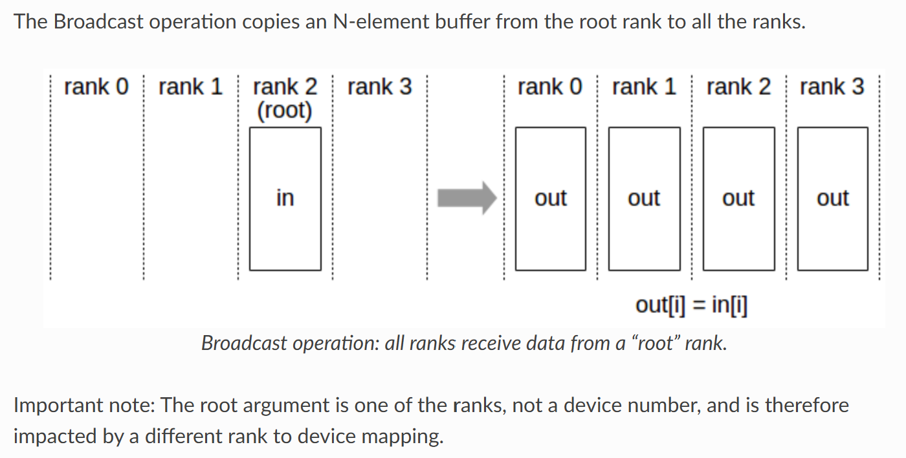
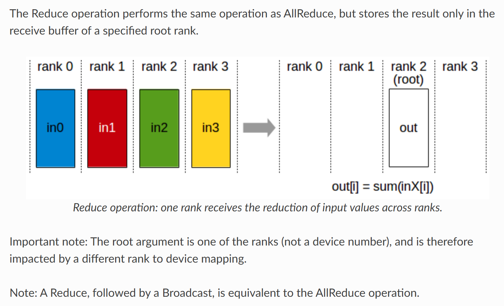
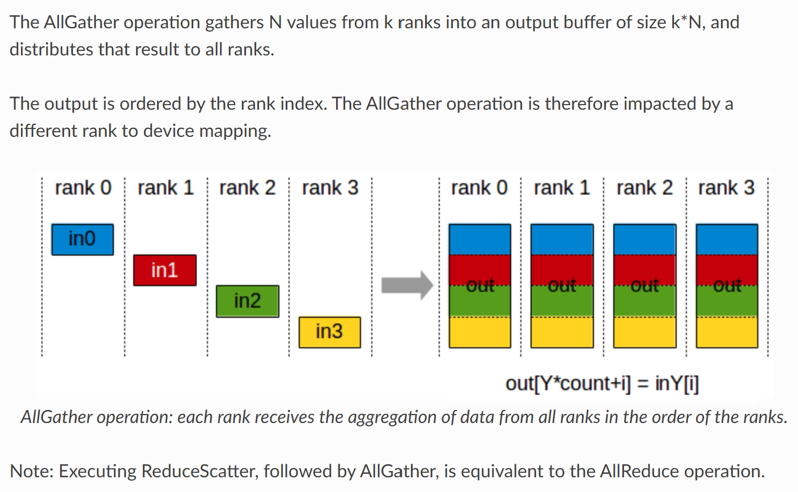
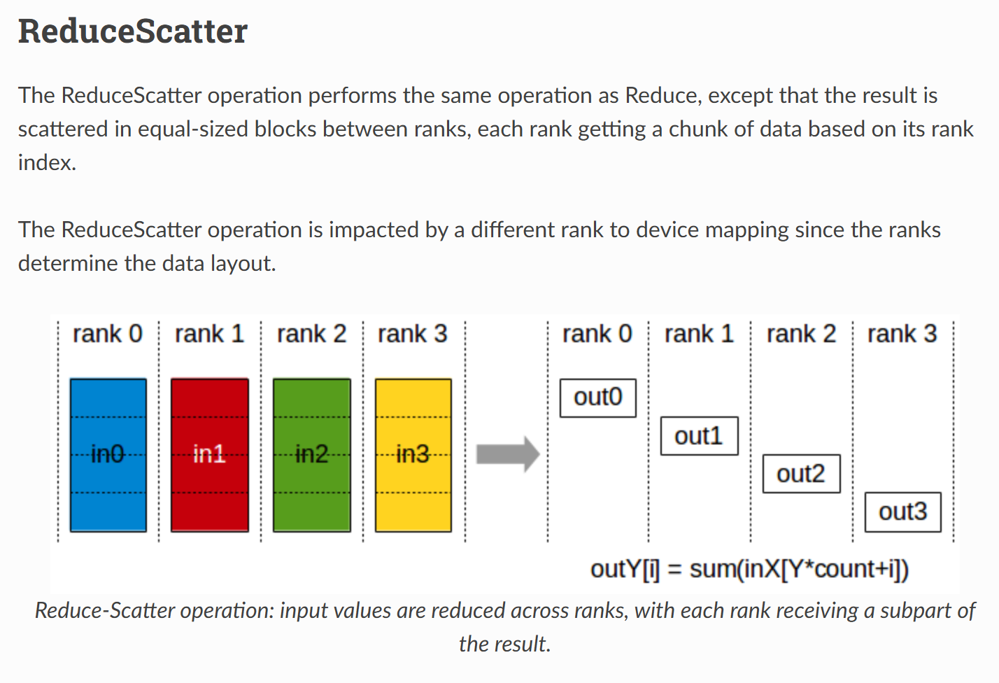

# Distributed Training for Large Deep Networks

Setting (Training on multiple GPUs):
- One model
  - One set of weights
- Large dataset
- Multiple GPUs

## 1. Data Parallelism 1.0

### Overview
- **Basic Concept:** A single copy of the model is placed on a server and each GPU stores its own replica of the model. The dataset is split into smaller chunks, and each GPU processes a chunk independently.
- **Workflow:**
  1. Each GPU performs forward and backward passes to compute gradients.
  2. Gradients are sent to the model server.
  3. The server aggregates the gradients, updates the weights, and sends the updated weights back to the GPUs.

### Advantages
- Simple to implement.
- Provides near-linear speedup with a small number of GPUs ($nGPUs<= 8$).
- Memory savings as optimizer states can reside on the model server.

### Issues
- **Synchronization Overhead:** Communication delays due to transferring gradients to and from the server.
- **Bottleneck at Model Server:** Centralized server can become a performance bottleneck.
- **Idle GPUs:** GPUs may remain idle while waiting for the slowest GPU or server synchronization.
- **High Communication Cost:** Requires transferring gradients twice (to the server and back).
- Model should fit on single GPU.

---

## 2. Data Parallelism 1.1 (Modern Approach)

### Overview
- **Improvement:** Removes the centralized model server and uses the **all-reduce operation** for gradient synchronization among GPUs.
- **Workflow:**
  1. Each GPU independently computes forward and backward passes.
  2. Gradients are synchronized using the all-reduce operation, which aggregates gradients across all GPUs.
  3. Each GPU applies the optimizer step locally.

### Advantages
- Eliminates the model server, reducing bottlenecks and improving communication efficiency.
- Faster communication due to hardware support for all-reduce operations (e.g., NCCL by NVIDIA).
- Simpler implementation compared to Data Parallelism 1.0.

### Issues
- **Optimizer State Divergence:** Optimizer states and weights across GPUs can diverge if not properly synchronized.
- **Dependency on Batch Size:** Inconsistent batch sizes or normalization dependencies can cause training instability.
- **Model Size Limitation:** The entire model, gradients, and optimizer state still need to fit into each GPU’s memory.

### Considerations for Implementation
- Ensure consistent optimizer states and synchronization.
- Handle batch size and normalization carefully to avoid divergence.
- Recommended for systems with up to 8-16 GPUs for near-linear speedup.

---

## 3. Model Parallelism

### Overview
- **Concept:** Splits the model across multiple GPUs rather than replicating it. Each GPU processes a subset of the model.
- **Types:**
  1. **Pipeline Parallelism**: Splits the model by layers.
  2. **Tensor Parallelism**: Splits tensors within layers across GPUs.

---

## 4. Pipeline Parallelism

### Workflow
- **Forward Pass:**
  1. The input data flows through the model layer by layer.
  2. Each layer or a group of layers is assigned to a specific GPU.
  3. Activations are passed between GPUs.
- **Backward Pass:**
  1. Gradients are computed layer by layer in reverse order.
  2. Gradients are passed back through the pipeline.

### Addressing Pipeline Bubbles
- **Problem:** GPUs are idle when waiting for activations or gradients from the previous GPU.
- **Solution:** Use **micro-batching**:
  1. Split a large batch into smaller micro-batches.
  2. Allow multiple micro-batches to flow through the pipeline simultaneously, reducing idle time.
  3. Smaller micro-batches shrink the bubbles, ensuring better GPU utilization.

### Memory Efficiency
- Memory requirements scale **linearly with the number of GPUs.**
- For a model with \( N \) parameters and \( G \) GPUs:
  - Each GPU only holds \( N/G \) parameters, gradients, and optimizer states.

### Advantages
- Significantly reduces memory requirements.
- Enables training models larger than a single GPU’s memory capacity.

### Issues
- Requires careful manual partitioning to balance computation across GPUs.
- Communication overhead for transferring activations and gradients between GPUs.

---

## 5. Tensor Parallelism

### Overview
- Splits tensors within a single layer across multiple GPUs.
- Synchronization occurs for each tensor operation, making it more complex to implement and less commonly used.

### Historical Context
- Tensor parallelism was used in early deep learning models (e.g., AlexNet) but has become less popular due to its complexity with modern architectures and multi-GPU setups.

---

## Concluding Remarks

### Key Takeaways
- **Data Parallelism 1.0:** Simple but inefficient due to centralized model server.
- **Data Parallelism 1.1:** Removes the server, improves efficiency with all-reduce, but requires careful optimizer state management.
- **Pipeline Parallelism:** Reduces memory requirements linearly with GPUs, but requires addressing pipeline bubbles.
- **Tensor Parallelism:** Effective but complex, less commonly used today.

### Modern Trends
- Combining pipeline parallelism and data parallelism enables efficient training of massive models (e.g., 70B+ parameters).
- Optimization techniques (e.g., mixed precision training, advanced parallelism strategies) are critical to maximize throughput and minimize memory usage in distributed training setups.

## Collective Operations
[Collective operations](https://docs.nvidia.com/deeplearning/nccl/user-guide/docs/usage/collectives.html) have to be called for each rank (hence CUDA device), using the same count and the same datatype, to form a complete collective operation. Failure to do so will result in undefined behavior, including hangs, crashes, or data corruption.

### All Reduce

### Broadcast 

### Reduce 

### All Gather

### Reduce Scatter

